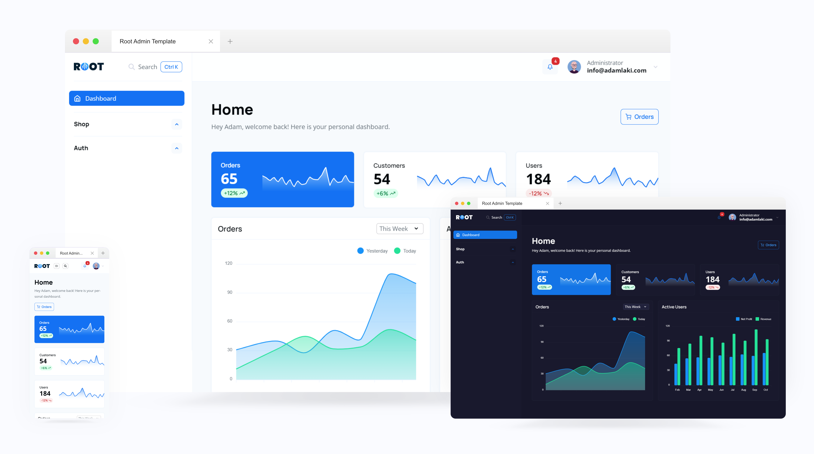

<p>
    <a href="https://sprucecss.com/">
        <br>
        <picture>
            <source media="(prefers-color-scheme: light)" srcset="./.github/spruce-logo-dark.svg">
            <source media="(prefers-color-scheme: dark)" srcset="./.github/spruce-logo-light.svg">
            
        </picture>
        <br>
    </a>
</p>

**This repository contains the static template of our Laravel admin named [Root](https://root.conedevelopment.com/).**



The template is built with Eleventy for our sanity and easier management. You can grab the content from the Nunjucks template files or the compiled `dist` folder.

The template will probably change regularly in the future because of the Laravel package development.

## What You Get

We used [Alpine.js](https://alpinejs.dev/) to handle the JS code. Although there are some quite complete JS behaviors, this template is still static HTML/CSS, so you have to do the interactive part.

**Right now, you can grab the following views or layouts:**

- [Dashboard](https://root-admin.sprucecss.com/)
- [Product List](https://root-admin.sprucecss.com/products/)
- [Order List](https://root-admin.sprucecss.com/orders/)
- [Customer List](https://root-admin.sprucecss.com/customers/)
- [Category List](https://root-admin.sprucecss.com/categories/)
- [Item Edit](https://root-admin.sprucecss.com/item/edit/)
- [Item View](https://root-admin.sprucecss.com/item/view/)
- [Settings](https://root-admin.sprucecss.com/settings/)
- [Sign In](https://root-admin.sprucecss.com/sign-in/)
- [Sign Up](https://root-admin.sprucecss.com/sign-up/)
- [Password Reset](https://root-admin.sprucecss.com/password-reset/)

**There are a lot of admin-specific components:**

- Modal window with customizations.
- Data table block with search and filter support.
- Simple search.
- Various drop-down menus.
- Widget cards.
- Media handler modal.
- Combobox.

## Get Up and Running

We use `eleventy --serve` and compile Sass with sass-cli with npm scripts.

1. **Clone the repository.**

2. **Install the dependencies.**

    In the `package.json` file, you will find all of the dependencies (and scripts) to install them using the following command:

    ```shell
    npm install
    ```

3. **Run the development mode**

    To run the development mode, use the `npm script`.   This script will also watch for changes.

    ```shell
    npm start
    ```

4. **Run the production mode**

    Before you go live, you should use the production script to compress the Sass files.

    ```shell
    npm run prod
    ```

## SCSS

The project compiles the SCSS files from the `./src/scss` folder into the `./src/css` folder. The project includes [Spruce CSS](https://sprucecss.com/), which gives the styling with some [Spruce UI](https://sprucecss.com/ui/getting-started/introduction/) components.

## Other Scripts

- **sass:lint/sass:lint:fix** You can lint your SCSS files with [Stylelint](https://stylelint.io/) and [stylelint-config-sass-guidelines](https://github.com/bjankord/stylelint-config-sass-guidelines) preset with the `npm run sass:lint` command. Use the `npm run sass:lint:fix` command if you want automatic fixes.

- **js:lint/js:lint:fix** You can also lint your JS like with Sass. For the rules, we use the Airbnb preset.

## License

The code is licensed under the [MIT](LICENSE).
